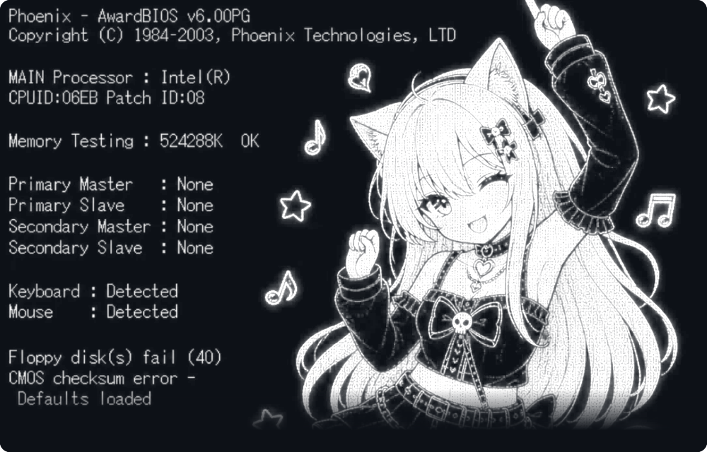

### 〔 about 〕

My name is Stella. I'm just a developer who loves to code.

### 〔 stack 〕

<table>
<tr><td><code>languages</code></td><td>

</td></tr>
<tr><td><code>databases</code></td><td>

</td></tr>
<tr><td><code>frameworks</code></td><td>

</td></tr>
<tr><td><code>tools</code></td><td>

</td></tr>
<tr><td><code>apis</code></td><td>

</td></tr>
</table>

### 〔 status 〕

